# 快速开始


## 基础配置

**克隆项目**

```
git clone https://gitee.com/dromara/RuoYi-Cloud-Plus.git
```

**切换分支**

```
git checkout -b v2.6.0_dev v2.6.0
```

**导入SQL**

导入这5个SQL到MySQL数据库中，一共75张表

```
└─sql
    ├─ry-cloud.sql
    ├─ry-config.sql
    ├─ry-job.sql
    ├─ry-seata.sql
    ├─ry-workflow.sql
```


## 启动和配置 Nacos

**ruoyi-nacos 模块**

修改 application.properties

```properties
### Connect URL of DB:
db.url.0=jdbc:mysql://192.168.1.12:40001/ruoyi-cloud-plus?characterEncoding=utf8&connectTimeout=1000&socketTimeout=3000&autoReconnect=true&useUnicode=true&useSSL=false&serverTimezone=UTC&allowPublicKeyRetrieval=true
db.user.0=root
db.password.0=Admin@123
```

**启动 Nacos**

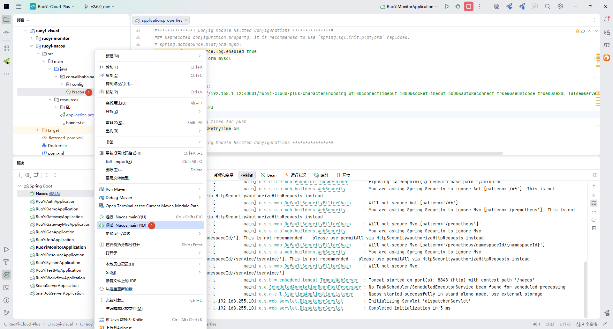

**编辑 Nacos 配置**

将 `srcipt/nacos/` 目录下的配置文件拷贝到 Nacos 配置中

配置文件相关的服务配置需要根据实际情况修改

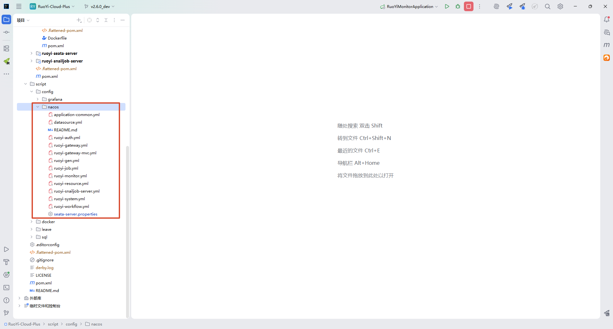

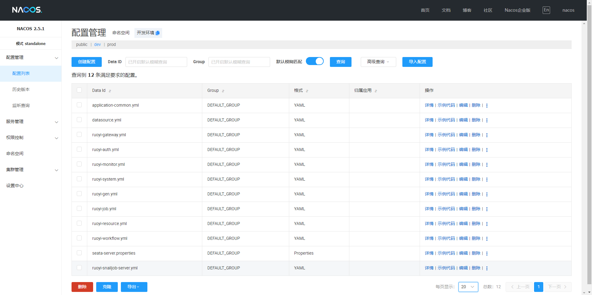


## 启动项目

按照顺序启动

### monitor

**ruoyi-monitor 模块**

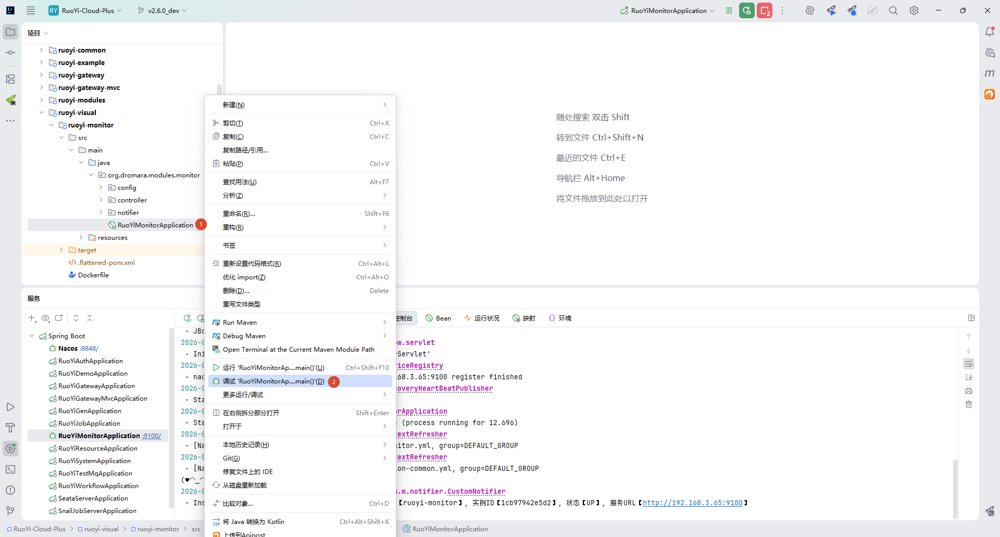

访问地址：http://localhost:9100/

账号密码：ruoyi/123456

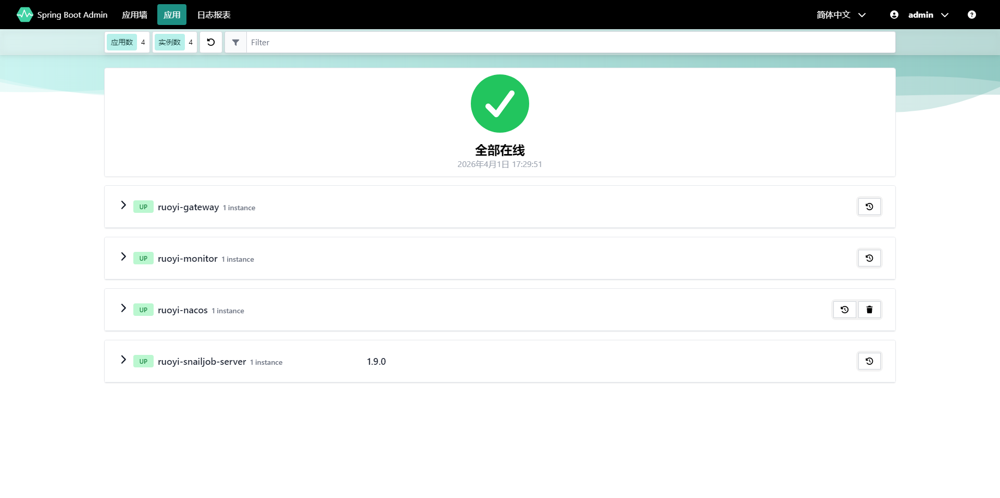

### snailjob-server

**ruoyi-snailjob-server 模块**

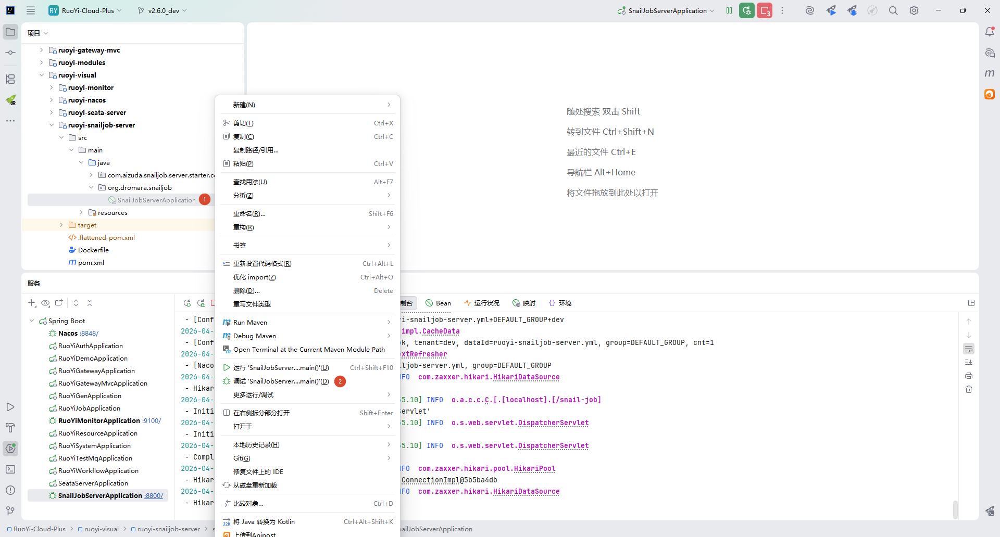

访问地址：http://localhost:8800/snail-job

账号密码：admin/admin


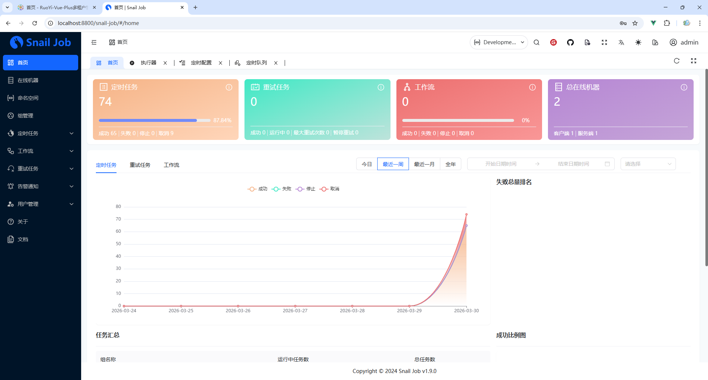


### gateway

**ruoyi-gateway 模块**

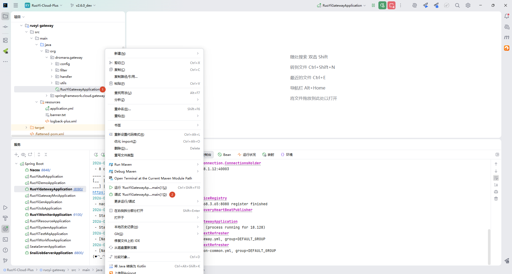

### auth

**ruoyi-auth 模块**

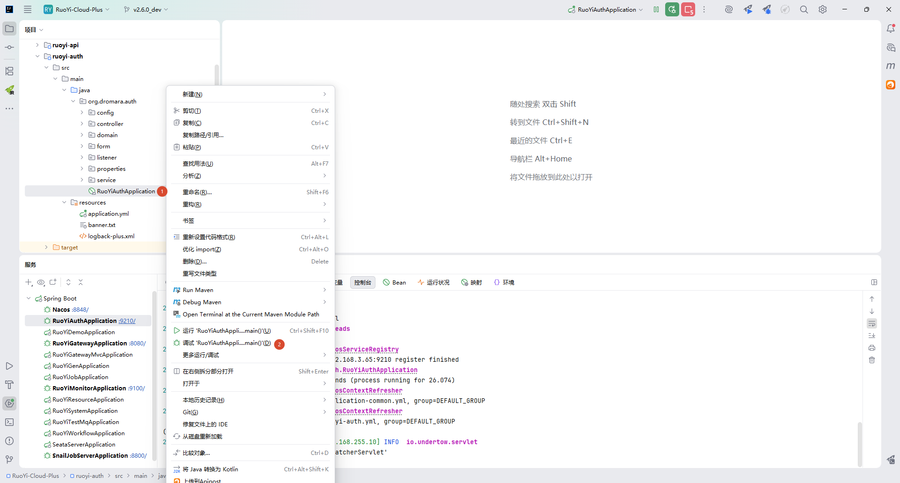

### system

**ruoyi-system 模块**

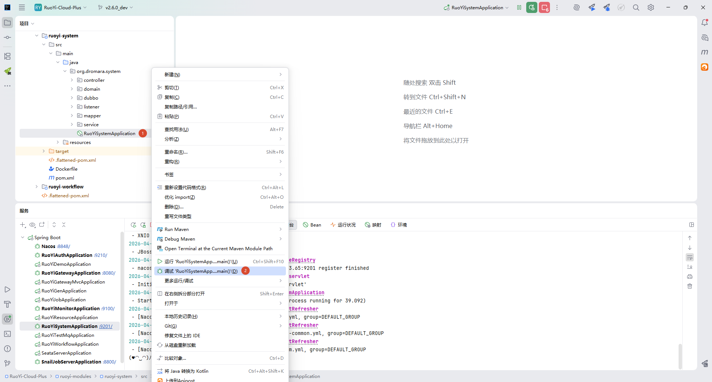

### resource

**ruoyi-resource 模块**

资源、文件上传、邮件、短信

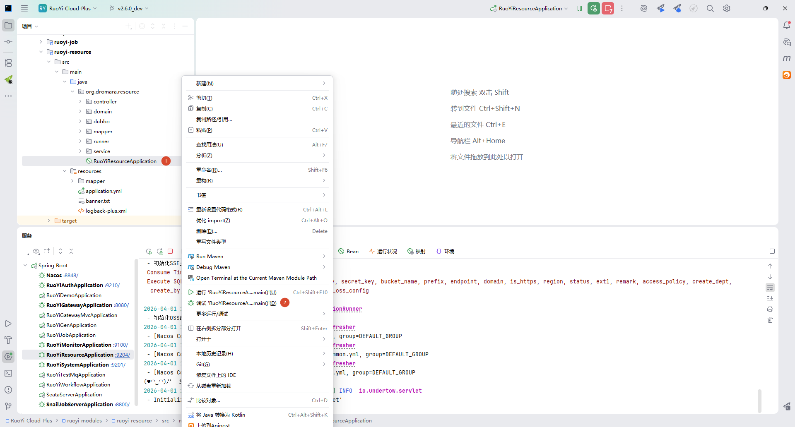

### workflow（可选）

**ruoyi-workflow 模块**

工作流

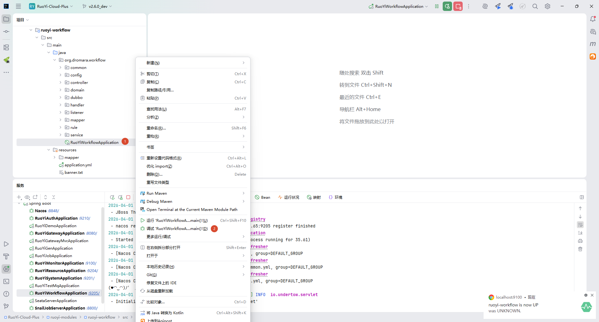

### gen（可选）

**ruoyi-gen 模块**

代码生成

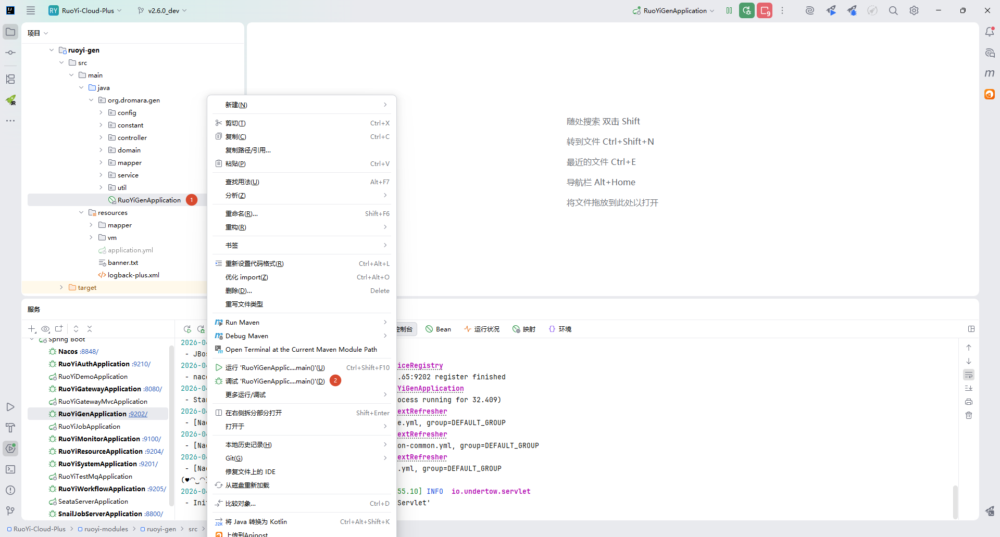

### job（可选）

**ruoyi-job 模块**

定时任务

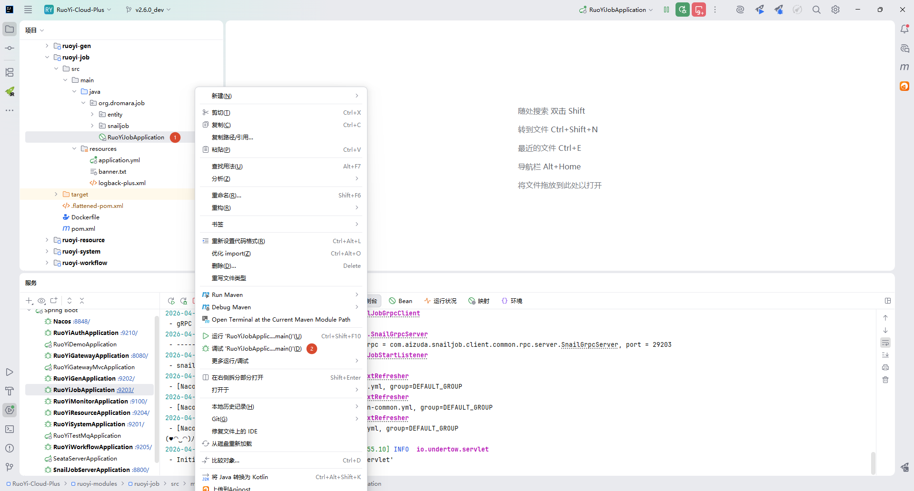


## 访问系统

启动前端：[参考文档](/ruoyi-plus-ui/quick-start/)

登录账号密码：admin/admin123


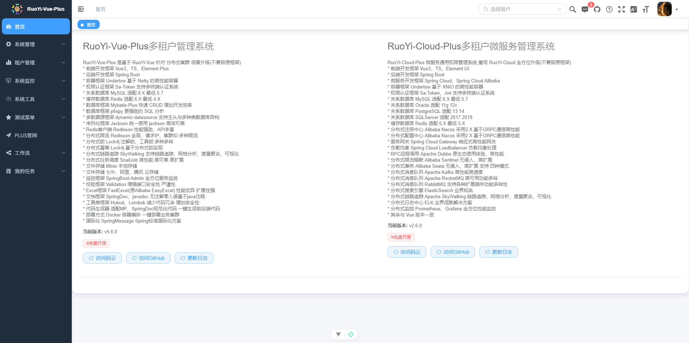


