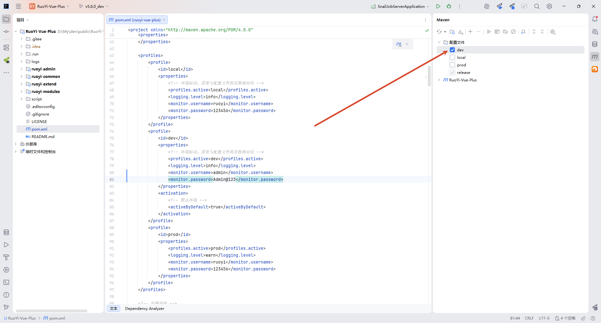
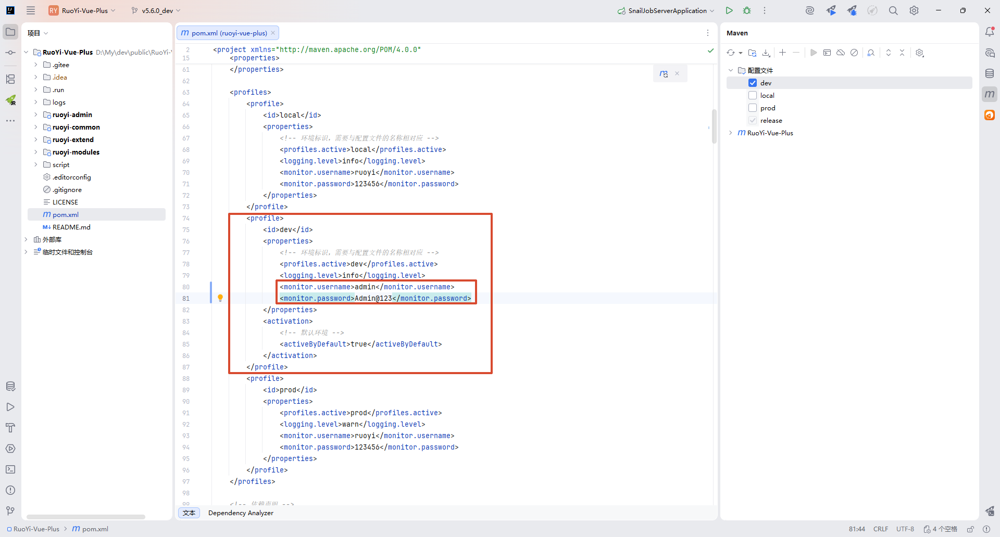
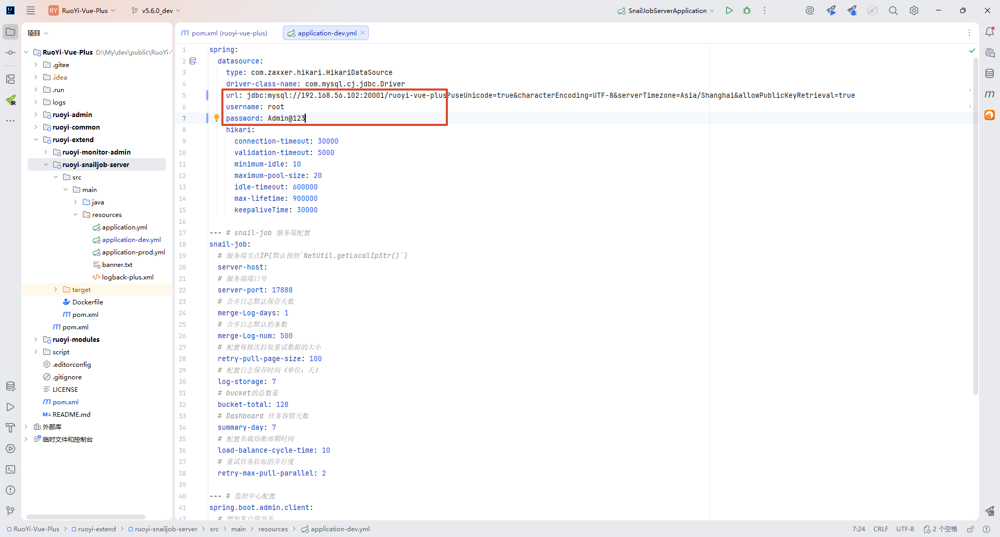
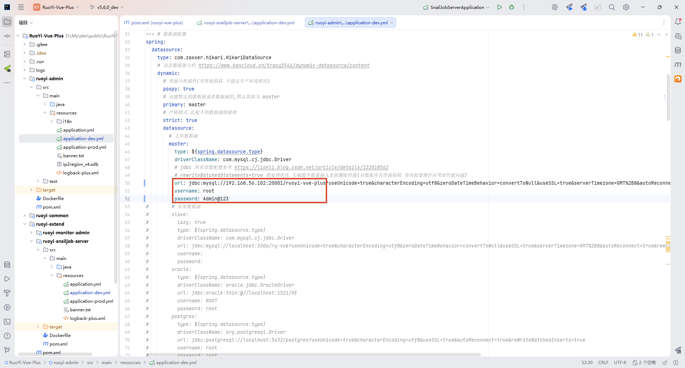
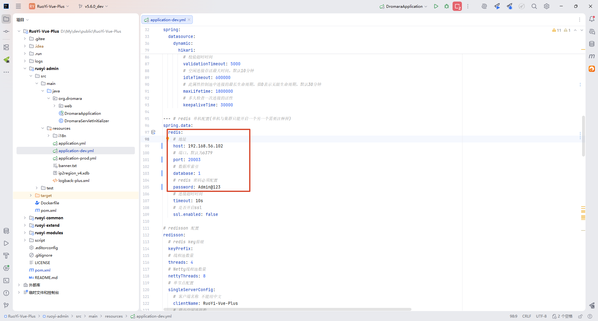
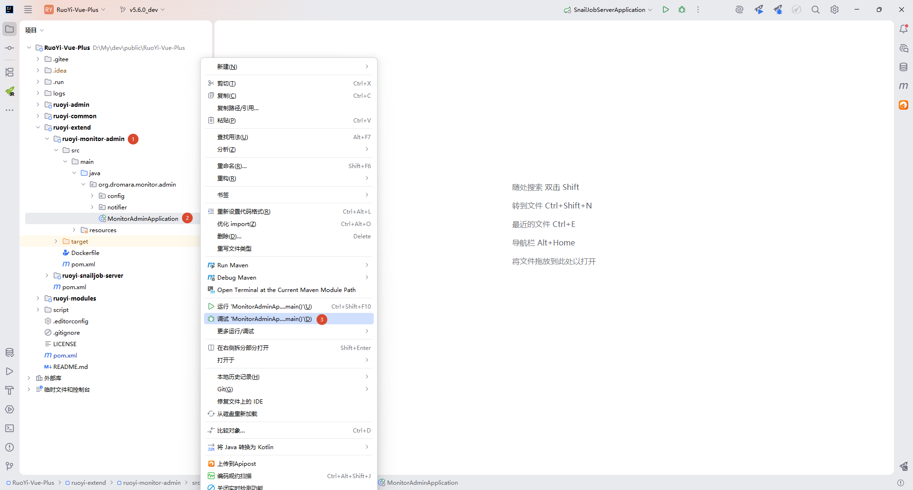
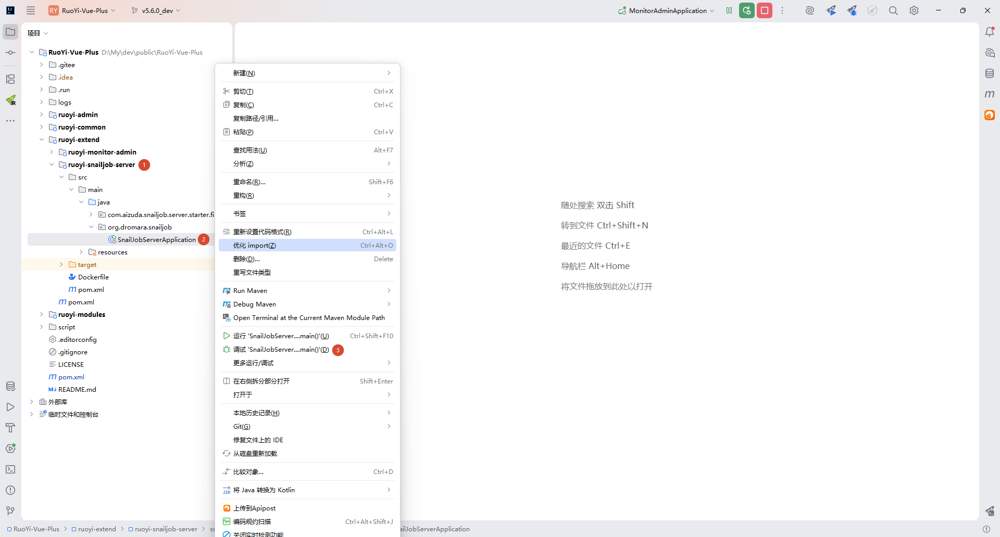
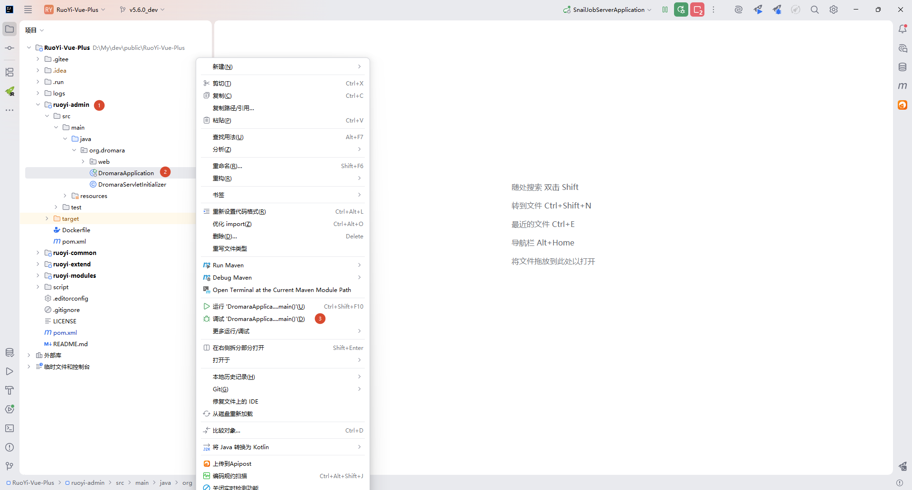
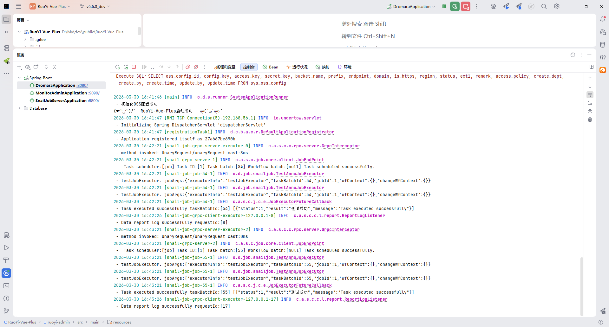

# 快速开始


## 基础配置

**克隆项目**

```
git clone https://gitee.com/dromara/RuoYi-Vue-Plus
```

**切换分支**

```
git checkout -b v5.6.0_dev v5.6.0
```

**导入SQL**

导入这三个SQL到MySQL数据库中，一共59张表

```
└─sql
    ├─ry_job.sql
    ├─ry_vue_5.X.sql
    ├─ry_workflow.sql
```


## 修改配置文件

### pom.xml

**勾选 dev 环境**



**修改 monitor-admin 的账号密码**

profile.dev 的 monitor.username 和 monitor.password



### application-dev.yml

**ruoyi-snailjob-server 模块**

修改mysql数据库信息



**ruoyi-admin 模块**

修改mysql数据库信息



修改redis信息



## 启动项目

按照顺序启动

**ruoyi-monitor-admin 模块**



**ruoyi-snailjob-server 模块**



访问地址：http://localhost:8800/snail-job

账号密码：admin/admin


**ruoyi-admin 模块**



启动成功日志

登录账号密码：admin/admin123



启动前端：[参考文档](/ruoyi-plus-ui/quick-start/)


