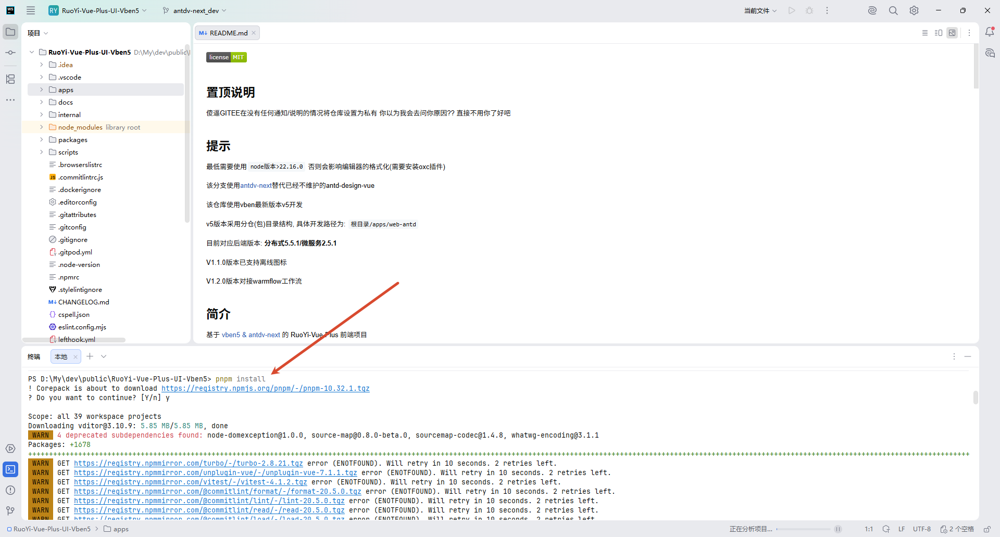
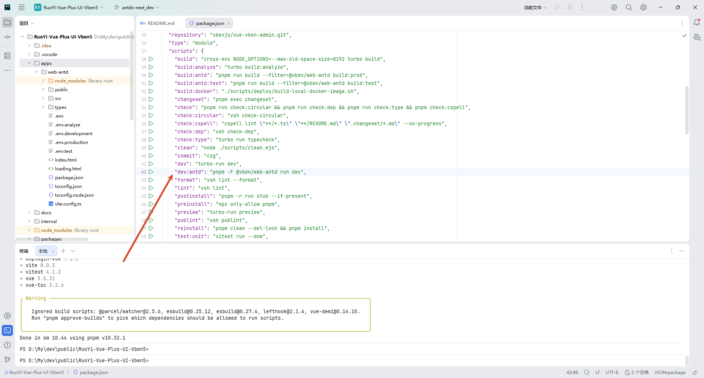
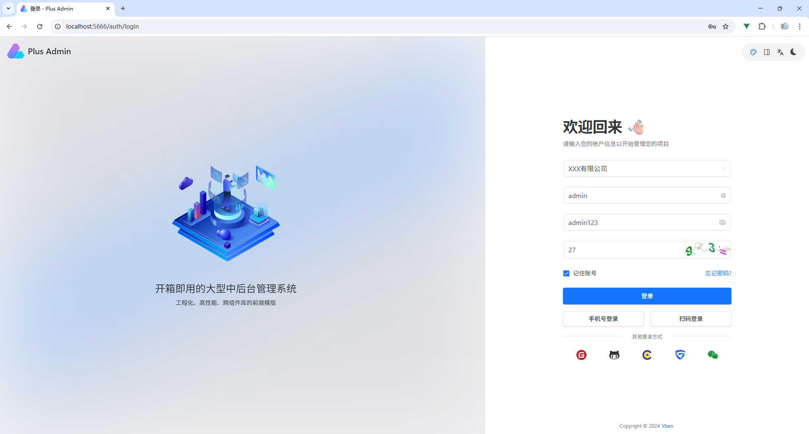
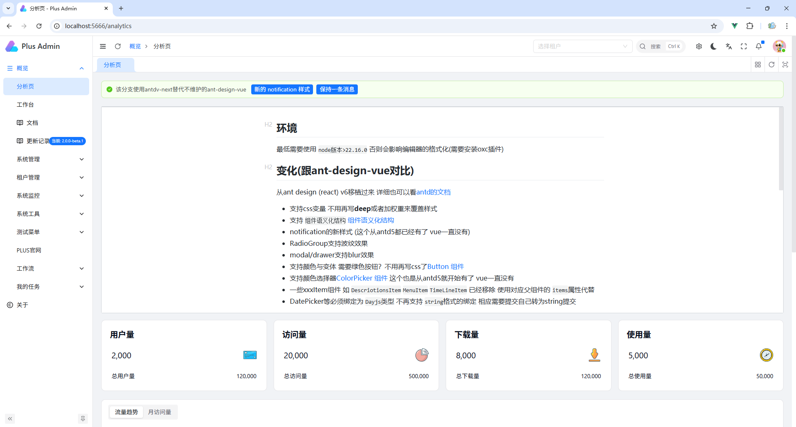

# 快速开始


## 基础配置

**克隆项目**

```
git clone https://github.com/imdap/ruoyi-plus-vben5.git RuoYi-Vue-Plus-UI-Vben5
```

**切换分支**

```
git checkout -b antdv-next_dev origin/antdv-next
```

**安装依赖**

```
pnpm install
```




## 启动项目

**启动开发环境**



启动后浏览器访问：http://localhost:5666/ 

账号密码：admin/admin123




