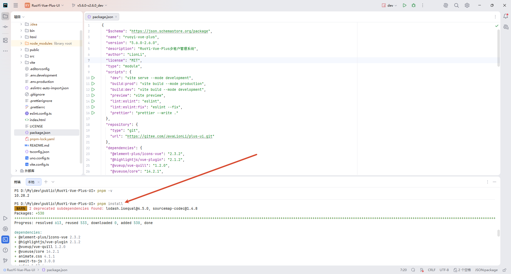
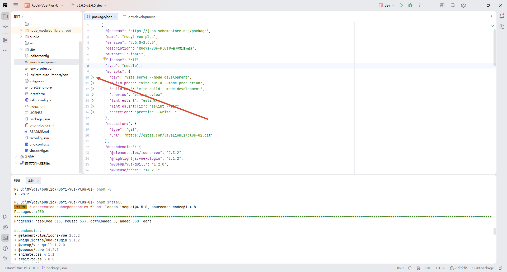
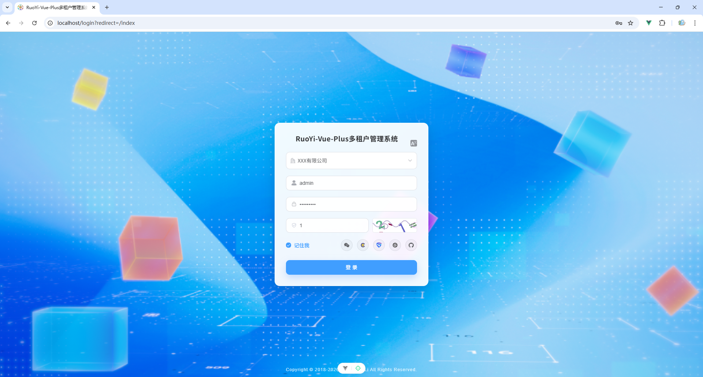
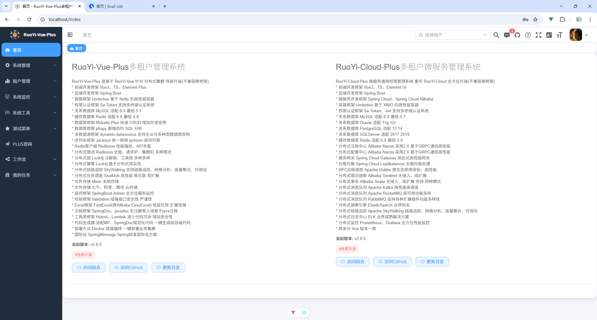

# 快速开始


## 基础配置

**克隆项目**

```
git clone https://gitee.com/JavaLionLi/plus-ui RuoYi-Vue-Plus-UI
```

**切换分支**

```
git checkout -b v5.6.0-v2.6.0_dev v5.6.0-v2.6.0
```

**安装依赖**

```
pnpm install
```




## 启动项目

**启动开发环境**



启动后自动弹窗浏览器访问：http://localhost/login?redirect=/index

账号密码：admin/admin123




